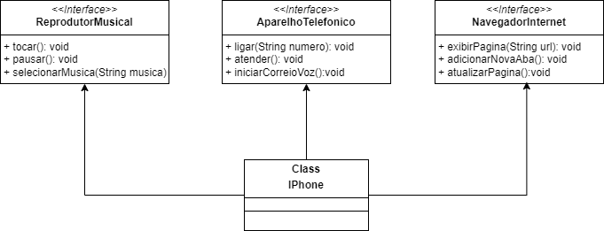

# POO - Desafio

## Tecnologias Utilizadas

#### Modelagem e Diagramação de um Componente iPhone
Neste desafio, iremos modelar e diagramar a representação UML do componente iPhone, abrangendo suas funcionalidades como Reprodutor Musical, Aparelho Telefônico e Navegador na Internet.

#### Funcionalidades a Modelar

  1. **Reprodutor Musical**
  - Métodos: `tocar()`, `pausar()`, `selecionarMusica(String musica)`
  2. **Aparelho Telefônico**
  - Métodos: `ligar(String numero)`, `atender()`, `iniciarCorreioVoz()`
  3. **Navegador na Internet**
  - Métodos: `exibirPagina(String url)`, `adicionarNovaAba()`, `atualizarPagina()`

Neste desafio, iremos modelar e diagramar a representação UML do componente iPhone, abrangendo suas funcionalidades como Reprodutor Musical, Aparelho Telefônico e Navegador na Internet.

## Objetivo
1. Criar um diagrama UML que represente as funcionalidades descritas acima.
2. Implementar as classes e interfaces correspondentes em Java (Opcional).

## UML

